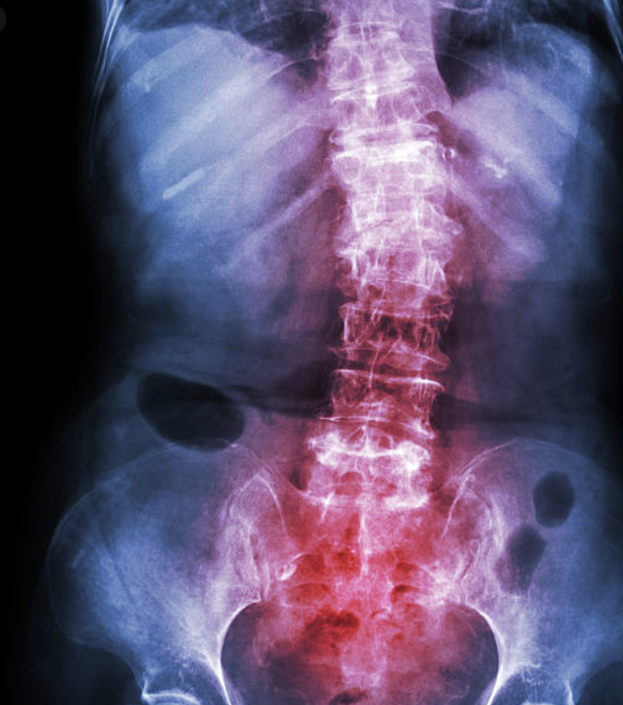

Data Science Capstone: Classification of Spondylolisthesis
========================================================
author: Michelle Ide
date:  March 2021

    
The Code
========================================================

<h4>
<a href="https://github.com/mishide/Springboard/blob/master/Capstone_1/scripts/Spondylo_Classification_EDA.ipynb" target="_blank">EDA</a>&nbsp;&nbsp;&nbsp;&nbsp; performs the cleaning and initial statistical analysis
  
<a href="https://github.com/mishide/Springboard/blob/master/Capstone_1/scripts/Spondlyo_Classification_Models.ipynb" target="_blank">Machine Learning Models</a>&nbsp; 1) build and tests the models 2) results & recommendations
</h4>
  

 

Project
========================================================

<h3> Correctly label 97% of "Abnormal" x-rays versus 56% with this model</h3>

This Machine Learning project demonstrates an improvement of x-ray result sensitivies (true positives) from 56% to 97%. The model provided is a validation tool, useful in saving cost, time, and stress for radiologists.  By learning from correctly labeled results, performing a statistical method of simultaneous comparisons on angles, and labeling the most probable result, a radiologist can validate especially the most challenging "boundry" cases. 

   

Why
========================================================

<cite>A study published in "The Spine" in 2017 found sensitivity results across 10 radiology sites to be 56% with the best sensitivity of 72% for one site.  This means, on average, all the x-rays labeled "Abnormal" were actually "Normal" 44% of the time - resembling the flip of a coin.</cite>
  

Determinination of Abnormal versus Normal results is particularly difficult with Spondylolisthesis in boundry cases.  Over 30% of results are near the boundry between Normal and Abnormal values which translates to inconsistencies in interpretation with human interpretations.  These x-rays contain quantitative measurements that require simultaneous comparisons to properly label, something machine learning has proven to be well suited.

Data
========================================================

The data for this project came from Kaggle's collection "Biomechanical Features in Orthopedic Patients".
    
* 309 records after outlier removal.
   
* The data is clean and contains no null values.
   
* 1 Target binomial variable (Normal/Abnormal)
     
* 6 quantitative variables: 

        Pelvic Tilt

        Pelvic Incidence

        Pelvic Radius

        Lumbar Lardosis Angle

        Sacral Slope

        Degree Spondylolisthesis
  

Approach
========================================================

Six well-known classification models were tested using 70% of the data to train and 30% to test. A large range of potential hyper parameter settings were tested for each model, determining the best settings for this project. Each model was selected due to it's usefulness in classification problems and it's differences in algorithmic process compared to the remaining models.

A stratified train-test split was used due to the imbalanced data in combination with upsampling methods performed during crossvalidation.  Upsampling methods were selected for their performance and potential for addressing the complexity in 'boundry' cases that exist in this project.  SMOTE-TL was determined to perform best overall by research performed in 2018 by 'Santos, Soares, Abreu, Araujo"(ref2).  ADASYN was included due to it's approach to the minority class, adding weight to boundry minority data in an effort to amplify and clarify separation.

Modeling
========================================================

6 models were tuned and tested for accuracy.  
 
    
    * Logistic Regression:  low CPU cost, easy to tune, linear based is sensitive to feature corr & outliers
    * Gradient Boost:  combines multiple trees to reduce overfitting, high CPU cost & tuning
    * Support Vector Machine:  +imbalance & smaller datasets, difficult to tune - needs large boundaries
    * Random Forest Classifier: less prone to overfitting, lower accuracy for highly corr features
    * Kneighbors Classifier: evolves & flexible hyper parameters, sensitive to outliers & data imbalance
    * Gaussian Naive Bayes: Not sensitive to outliers or imbalances, assumes feature independence
 

Results
========================================================

Logistic Regression preformed with the highest accuracy of 91%, Support Vector Machine 88%. </small> 
  
Using the ADASYN upsampling method: Out of 100 samples, 10 will be false positive ( Abnormal ), and 0 will be false negative ( Normal )
  
Using SMOTE-TL: Out of 100 samples, 7 will be false positive ( Abnormal ) and 1 will be false negative ( Normal )

                              

Recommendations
========================================================

Logistic Regression is the clear top performer, however, imbalanced data can be expected to be the normal in production and the decision between upsammpling methods would require feedback from decision makers on specificity.  While SMOTE-TL provides the best overall performance, in healthcare I believe the avoidance of false negatives is more desirable which can be seen with ADASYN demonstraing 0 false negatives.  

I would recommend additional testing of Support Vector Machine as well, which could be done side-by-side with Logistic Regression. I suspect the linear nature of Logistic Regression may reduce performance in real-world applications due to it's sensitivity to extremes and outliers.  In this case 1 outlier was removed prior to testing, however in production the removal of outliers without damaging results could be difficult.  The SVM performed very similar to logistic regression and has an algorithm that handles extreme values in a way that does not impact the remaining values, it has a more flexible boundry versus a straight line.

Future Development
========================================================

Test several stacking methods to search for improved accuracy - this would provide additional layers of testing results to verify.
Test and train LR and SVM on more data, 309 samples is not bad to start but much more would be needed to validate results condidently.
Create unique splits to data prior to train-test split to test sparse data processing for small radiology departments with fewer results to run.

References
========================================================

ref1:  The Spine Journal, Volume 17, Issue 4, April 2017, Pages 554-561
     Link: https://www.sciencedirect.com/science/article/pii/S1529943016310932
  ref2:  Cross-Validation for Imbalanced Datasets: Avoiding Overoptimistic and Overfitting Approaches, October 2018IEEE Computational Intelligence Magazine 13(4):59-76, DOI: 10.1109/MCI.2018.2866730 
    Link:  https://www.researchgate.net/publication/328315720_Cross-Validation_for_Imbalanced_Datasets_Avoiding_Overoptimistic_and_Overfitting_Approaches
